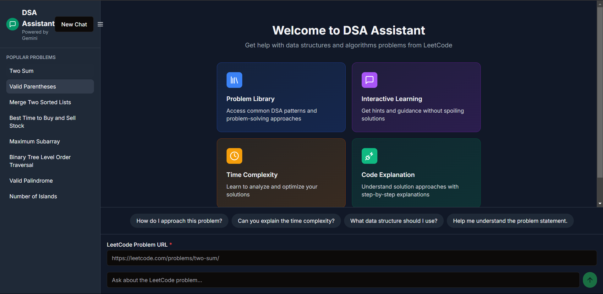
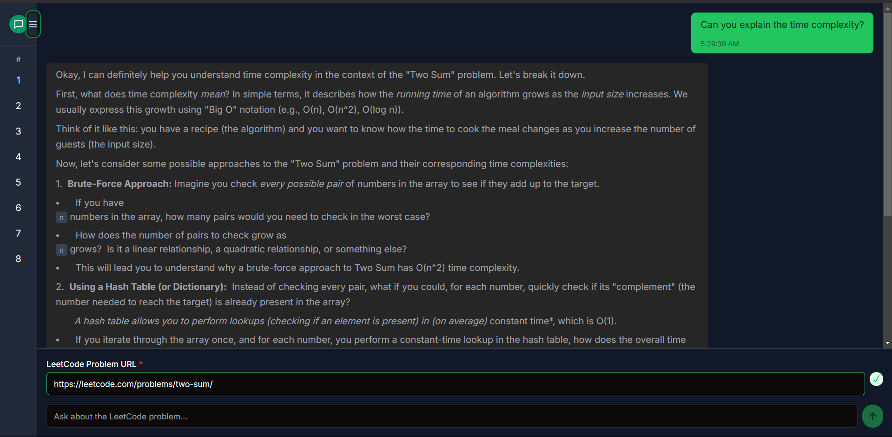
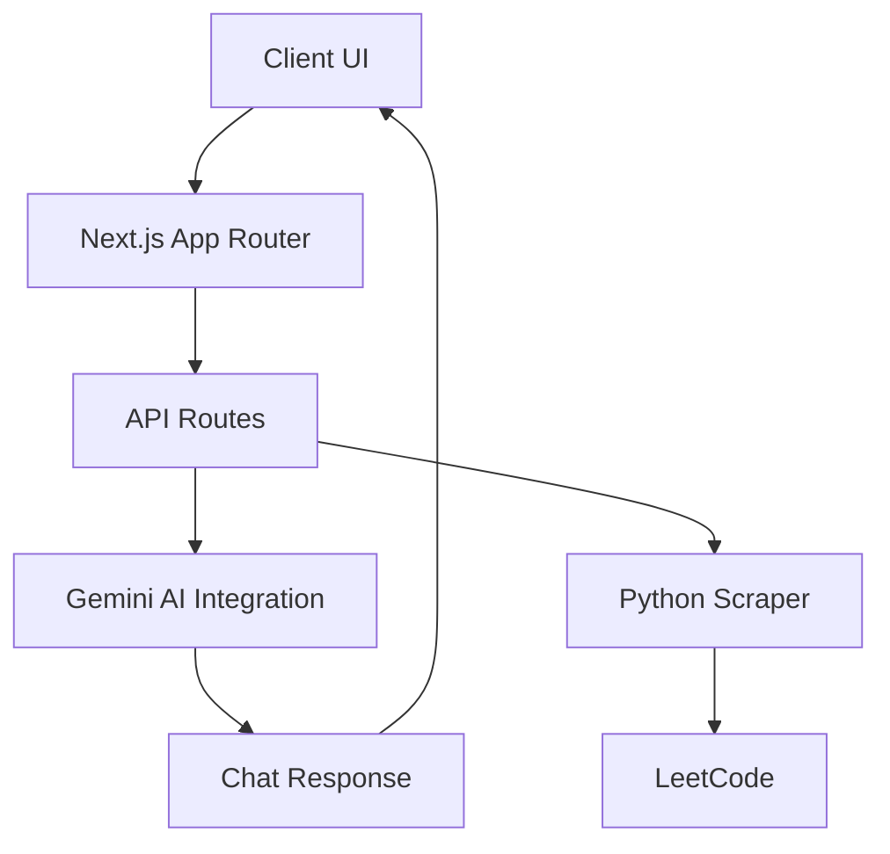

# DSA Assistant

An interactive AI assistant powered by Gemini to help with LeetCode problems and data structures & algorithms concepts.



## Features

- 🤖 AI-powered assistance with LeetCode problems
- 💡 Interactive guidance without direct solutions
- 📚 Access to popular LeetCode problems
- 🎯 Focused problem-solving approach
- 🔄 Context-aware conversations
- 🌗 Dark/Light mode support
- 📱 Responsive design with collapsible sidebar

## Key Features

- **Problem Context Retention**: Maintains conversation context between messages while efficiently managing problem descriptions
- **Smart Problem Fetching**: Only fetches problem descriptions for new chats or when switching problems
- **Popular Problems**: Quick access to frequently solved LeetCode problems
- **Intuitive Interface**: Clean UI with expandable/collapsible sidebar
- **Guided Learning**: Get hints and conceptual understanding without direct solutions

## Tech Stack

- Next.js 13 (App Router)
- TypeScript
- Tailwind CSS
- Gemini API
- Shadcn UI Components

## Setup Instructions

1. **Prerequisites**:
   - Node.js 16.x or higher
   - Python 3.6 or higher
   - Chrome browser (for LeetCode scraping)
   - Git

2. **Clone and Setup**:
   ```bash
   git clone https://github.com/yourusername/dsa-assistant.git
   cd dsa-assistant
   ```

3. **Install Dependencies**:
   - Node.js dependencies:
     ```bash
     npm install
     ```
   - Python dependencies:
     ```bash
     pip install selenium webdriver_manager
     ```

4. **Environment Configuration**:
   - Create a `.env` file in the root directory
   - Add your Gemini API key:
     ```
     GEMINI_API_KEY=your_api_key_here
     ```
   - Get your API key from: https://makersuite.google.com/app/apikey

5. **Development Server**:
   ```bash
   npm run dev
   ```
   Open [http://localhost:3000](http://localhost:3000) in your browser

6. **Troubleshooting**:
   - If Python script fails: Ensure Chrome and Python are in system PATH
   - For dependency issues: 
     - Try `npm clean-install`
     - If npm install fails, use: `npm install --legacy-peer-deps`
   - For API errors: Verify your Gemini API key is valid

## Architecture Overview

The application follows a modern Next.js architecture with several key components:



### Key Components:

1. **Frontend Layer**:
   - Next.js 14 App Router for routing and rendering
   - React components with TypeScript
   - Tailwind CSS for styling
   - ShadcnUI for component library

2. **Backend Layer**:
   - API Routes for handling requests
   - Python script for LeetCode scraping
   - Gemini AI integration for chat responses

3. **Data Flow**:
   - Problem details fetched from LeetCode
   - Chat history maintained in client state
   - Streaming responses from Gemini AI

## Usage Guidelines

1. **Starting a Session**:
   - Open the application in your browser
   - Use the sidebar to browse popular LeetCode problems
   - Or paste a specific LeetCode problem URL

2. **Problem Interaction**:
   - Click on a problem to load its details
   - The AI will maintain context throughout the conversation
   - Use the dark/light mode toggle for comfort

3. **Getting Help**:
   - Ask specific questions about the problem
   - Request explanations of concepts
   - Ask for approach suggestions
   - Use the "New Chat" button to start fresh

4. **Best Practices**:
   - Be specific in your questions
   - Focus on understanding concepts
   - Use the collapsible sidebar for better focus
   - Save important conversations for reference

## GPT Integration Details

The application uses Google's Gemini AI model with several key features:

1. **Context Management**:
   - Maintains conversation history
   - Tracks problem context across messages
   - Intelligent problem description caching

2. **Safety Measures**:
   - Strict boundaries against providing direct code solutions
   - Focus on conceptual understanding
   - Emphasis on teaching and guidance

3. **Technical Implementation**:
   - Uses `gemini-2.0-flash` model
   - Streaming responses for better UX
   - Automatic problem context injection
   - Dynamic prompt engineering based on conversation state

4. **Integration Flow**:
   ```mermaid
   sequenceDiagram
       Client->>API: Send message
       API->>LeetCode: Fetch problem (if new)
       API->>Gemini: Send context + message
       Gemini->>API: Stream response
       API->>Client: Stream chunks
   ```

## Project Structure

```
dsa-assistant/
├── app/
│   ├── api/
│   │   └── chat/
│   │       └── route.ts      # API endpoint for chat
│   ├── layout.tsx
│   └── page.tsx              # Main chat interface
├── components/
│   └── ui/                   # Reusable UI components
├── scripts/
│   └── fetch_leetcode.py     # Python script for fetching problem details
└── styles/
    └── globals.css           # Global styles
```

## Contributing

Pull requests are welcome. For major changes, please open an issue first to discuss what you would like to change.

## License

[MIT](https://choosealicense.com/licenses/mit/)
